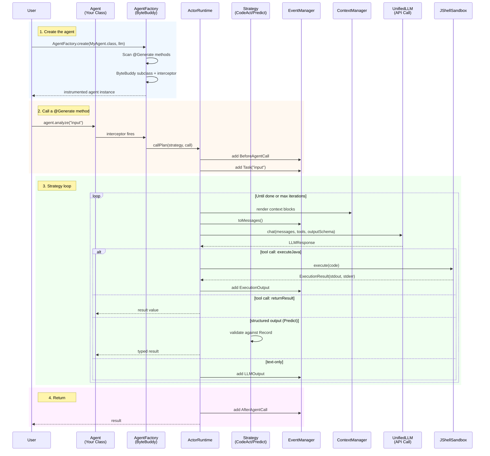
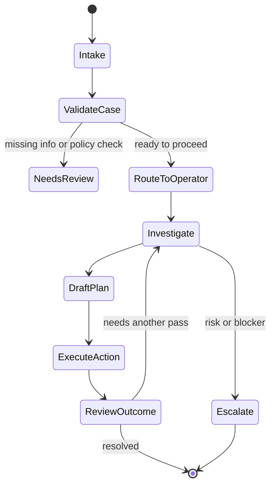

# NOOA Java — Object-Oriented Agents for Java

**An independent Java port of [NVIDIA's Object-Oriented Agents (NOOA)](https://github.com/nvidia-nemo/labs-OO-Agents) framework.**

The original Python framework by NVIDIA Labs ([research paper](https://arxiv.org/abs/2607.20709),
[tech blog](https://developer.nvidia.com/blog/six-agent-harness-capabilities-for-higher-model-performance/))
introduced the agent-as-a-single-class model. This project ports that design to Java 25+,
adapting Python idioms to the JVM ecosystem while preserving the six core design ideas:
typed I/O, pass-by-reference, code-as-action, programmable loops, object state,
and model-callable harness APIs.

An agent is a single Java class. Methods are capabilities, fields are state,
annotations are metadata. The SDK handles LLM generation, code execution,
and structured output enforcement.

## Repository layout and CLAD submodule

This repository contains the Java SDK and runtime for NOOA. The CLAD methodology
and agent tooling live in a separate repository that is connected here as a Git
submodule at [clad](clad).

This is intentional:

- the root repository tracks the Java SDK implementation
- the [clad](clad) directory is a separate Git repo with its own history and workflow
- the parent repo tracks the submodule by commit pointer, so updates to CLAD are
  pulled in deliberately rather than copied into the root repository automatically

For the exact rules and expected workflow, see [docs/clad-submodule.md](docs/clad-submodule.md).

## Quick Start

```java
class GreetingAgent extends Agent {
    public GreetingAgent(UnifiedLLM llm) { super(llm); }

    /** Create a warm, personalized greeting. */
    @Generate
    public String greet(String name) {
        throw new UnsupportedOperationException("Generated at runtime");
    }
}

var llm = UnifiedLLM.create(
    UnifiedLLM.openAI(System.getenv("OPENAI_API_KEY"), "gpt-4o").build());
var agent = AgentFactory.create(GreetingAgent.class, llm);
String greeting = agent.greet("Alice");
System.out.println(greeting);
```

**Requirements:** Java 25+ · Maven 3.9+

```xml
<dependency>
  <groupId>ai.nooa</groupId>
  <artifactId>nooa-core</artifactId>
  <version>0.1.0</version>
</dependency>
```

## Architecture



### Component Map

```
┌──────────────────────────────────────────────────────────┐
│                    Your Agent Class                        │
│  ┌──────────┐  ┌──────────┐  ┌────────────────────────┐  │
│  │ @Generate │  │ @Generate│  │ public String helper() │  │
│  │ String    │  │ @Strategy│  │ { return "done"; }     │  │
│  │ analyze() │  │ classify │  │                        │  │
│  └────┬─────┘  └────┬─────┘  └───────────┬────────────┘  │
│       │              │                    │               │
│  ┌────┴──────────────┴────────────────────┴───────────┐  │
│  │              AgentFactory (ByteBuddy)               │  │
│  │  Intercepts @Generate → routes to ActorRuntime     │  │
│  └──────────────────────┬─────────────────────────────┘  │
└─────────────────────────┼────────────────────────────────┘
                          │
┌─────────────────────────┼────────────────────────────────┐
│                 ActorRuntime                              │
│  ┌──────────┐  ┌──────────┐  ┌──────────┐  ┌──────────┐ │
│  │generate()│  │execute() │  │callPlan()│  │ stats()  │ │
│  └────┬─────┘  └────┬─────┘  └────┬─────┘  └──────────┘ │
└───────┼─────────────┼─────────────┼──────────────────────┘
        │             │             │
  ┌─────┴─────┐ ┌─────┴──────┐ ┌──┴────────────┐
  │ UnifiedLLM │ │JShellSandbox│ │Strategy        │
  │ (HTTP)     │ │ (JDK built- │ │ CodeAct        │
  │ OpenAI     │ │  in JShell) │ │ Predict        │
  │ Anthropic  │ │ Timeout     │ │ Reflexion      │
  │ OpenRouter │ │ Permissions │ └───────────────┘
  │ DeepInfra  │ └────────────┘
  │ Groq       │
  │ Ollama     │
  └────────────┘

┌──────────────────────────────────────────────────────────┐
│                 Supporting Services                       │
│  ┌──────────┐  ┌──────────┐  ┌──────────┐  ┌──────────┐ │
│  │ Context  │  │  Event   │  │  Memory  │  │ Tracing  │ │
│  │ Manager  │  │ Manager  │  │  (SQLite)│  │ (OTel)   │ │
│  └──────────┘  └──────────┘  └──────────┘  └──────────┘ │
│  ┌──────────┐  ┌──────────┐  ┌──────────┐  ┌──────────┐ │
│  │  Shell   │  │   MCP    │  │   Todo   │  │Snapshot  │ │
│  │  Tools   │  │ Manager  │  │ Manager  │  │Save/Rest │ │
│  └──────────┘  └──────────┘  └──────────┘  └──────────┘ │
└──────────────────────────────────────────────────────────┘
```

## Developer mental model: how to think about NOOA

The easiest way to reason about this framework is to treat an agent as a small
Java object with a clear boundary between deterministic logic and model-driven
reasoning.

- Deterministic Java code handles I/O, validation, orchestration, and state
- `@Generate` methods define the model-powered capabilities
- the runtime turns those method signatures into LLM tasks using the method name,
  return type, argument values, and the current agent context
- helper methods and fields are the agent's tools, memory, and state

This design makes the framework feel like ordinary Java, but with a runtime that
wraps each generated method in a disciplined prompt-and-tool loop.

### A practical pattern

```java
@SystemPrompt("You are a news summarizer.")
class NewsAgent extends Agent {
    public NewsAgent(UnifiedLLM llm) { super(llm); }

    // Deterministic Java: fetch and normalize inputs
    String fetchLatestHeadline() {
        return "Acme launches a battery chemistry that cuts charge time by 40%";
    }

    // Model-powered capability: summarize the actual content given to the method
    @Generate
    public String summarizeNews(String articleText) {
        throw new UnsupportedOperationException("Generated at runtime");
    }

    // Pure Java orchestrator: gather data, then delegate to the model
    public String summarizeCurrentNews() {
        var article = fetchLatestHeadline();
        return summarizeNews(article);
    }
}
```

The key idea is not that the method body is the instruction. The method contract is
it: the name, the parameters, the return type, and the surrounding context shape the
LLM prompt. For data-heavy tasks, include the actual input text in the prompt rather
than relying only on a vague method docstring.

### Use one agent for one job

Keep an agent focused on a single business capability:

- summarize articles
- classify tickets
- extract fields from a document
- plan the next action
- answer from a known domain model

Avoid building one giant agent that tries to do everything. Split the work into
small capabilities and orchestrate them in Java.

### A good organizational split

| Concern | Place it here |
|---|---|
| HTTP calls, file access, DB logic, validation | regular Java methods |
| classification, summarization, extraction, planning | `@Generate` methods |
| branching and sequencing | Java orchestrator methods |
| persistent memory and shared state | agent fields, context blocks, `MemoryStore` |
| model/tool instructions | `@SystemPrompt`, method naming, Javadoc, strategy selection |

This keeps the LLM focused on the tasks it is good at while leaving the rest to
Java.

## Example: business workflow as a state machine

Many agent systems are described as graphs or state machines, and that mental model
still applies here — but in NOOA the state machine is usually expressed in Java,
not in a separate workflow DSL.

The agent still has a lifecycle, but the lifecycle is the agent object itself:



A realistic implementation usually looks like this:

```java
enum WorkflowState { INTAKE, VALIDATE, ROUTE, INVESTIGATE, PLAN, EXECUTE, REVIEW, ESCALATED }

@SystemPrompt("You are a support and operations agent for customer requests.")
class SupportWorkflowAgent extends Agent {
    private WorkflowState state = WorkflowState.INTAKE;
    private final List<String> notes = new ArrayList<>();

    public SupportWorkflowAgent(UnifiedLLM llm) { super(llm); }

    // --- Deterministic Java transitions ---
    void markValidated() { state = WorkflowState.ROUTE; }
    void markNeedsReview() { state = WorkflowState.INVESTIGATE; }
    void markEscalated() { state = WorkflowState.ESCALATED; }

    // --- model-powered steps ---
    @Generate
    public String validateCase(String request) {
        throw new UnsupportedOperationException();
    }

    @Generate
    public String investigateIssue(String request) {
        throw new UnsupportedOperationException();
    }

    @Generate
    public String createPlan(String issueSummary) {
        throw new UnsupportedOperationException();
    }

    @Generate
    public String executeAction(String plan) {
        throw new UnsupportedOperationException();
    }

    // --- orchestrator: this is the workflow ---
    public String handleRequest(String request) {
        state = WorkflowState.INTAKE;
        notes.add(request);

        var validation = validateCase(request);
        if (validation.contains("needs_review")) {
            state = WorkflowState.INVESTIGATE;
            var findings = investigateIssue(request);
            var plan = createPlan(findings);
            state = WorkflowState.PLAN;
            return executeAction(plan);
        }

        state = WorkflowState.ROUTE;
        return validation;
    }
}
```

This is the important point: the agent is participating in a workflow, but the
workflow is not a separate engine. It is the agent's Java control flow plus the
runtime-provided LLM capabilities.

A workflow can still be looped, escalated, and revisited. For example:

- validate -> loop back to investigate if information is missing
- plan -> execute -> review -> loop if the result is incomplete
- escalate when the agent hits a blocker or risk threshold

That makes the workflow feel very much like a state machine, even though the
implementation lives in a normal Java object instead of a graph DSL.

## How this compares to other agent frameworks

The most important difference is not whether the framework is "agentic"; it is
what the primary abstraction is.

### LangGraph: graph-first orchestration

LangGraph treats the workflow as the main artifact. The program is expressed as
nodes, edges, conditions, and state transitions.

This is excellent when the business process itself needs to be inspected,
debugged, or modified as a graph. It is a natural fit for explicit workflows,
loops, and human-in-the-loop handoffs.

The cost is that the mental model is graph-heavy: you often design workflow
structure before designing the domain object that owns the task.

### Role-based systems: agent-first collaboration

Frameworks built around roles, teams, and message passing treat agents as
participants in a collaborative process. A manager agent may delegate to worker
agents, which then pass outcomes back through conversation or tool calls.

This is useful when the system is inherently social: multiple specialists, debate,
planning, delegation, or trial-and-error coordination.

The tradeoff is that the orchestration often sits above the business object. The
agent becomes a participant in a larger coordination layer rather than a native
part of the application domain model.

### NOOA: object-first orchestration

NOOA is different. The primary abstraction is still a Java object:

- state lives in fields
- helpers are regular Java methods
- `@Generate` methods are model-powered capabilities
- orchestration is plain Java control flow
- the runtime handles prompt generation, tool execution, and result validation

That means the workflow can be modeled as a method-driven state machine without
introducing a separate graph or workflow DSL. The business process is represented
in the class itself, in idiomatic Java.

| Framework | Primary abstraction | Orchestration style | Best fit |
|---|---|---|---|
| LangGraph | graph | explicit node/edge transitions | workflow-heavy systems with visible branching |
| Role-based agent systems | specialized agents | delegation and collaboration | multi-agent task decomposition |
| NOOA | Java object | method calls + runtime strategy loop | domain objects that need agent capabilities |

### Why NOOA feels simpler in Java

For Java developers, this is often the most natural shape:

- keep the business logic in normal Java classes
- express the workflow as method sequencing and state transitions
- reserve the LLM for the capability step, not the entire orchestration layer

Instead of rewriting the app around a graph engine, you put the agent where it
belongs: as a stateful Java object participating in your application logic.

This is especially valuable when the agent is embedded inside an operational
workflow, a service, or a domain object that already has real state and business
rules.

## Core Concepts

### 1. An Agent Is a Java Class

Every agent extends `Agent`. Every method has a role:

| Method type | How to write it | What happens |
|---|---|---|
| **Generation** | `@Generate` + Javadoc | Body replaced at runtime by LLM-generated code |
| **Deterministic helper** | Normal method body | Runs as regular Java, visible to the LLM |
| **Orchestrator** | Normal method body, calls other methods | Pure Java workflow — classify → route → act |

```java
@SystemPrompt("You are a legal intake specialist.")
class LegalIntakeAgent extends Agent {

    public LegalIntakeAgent(UnifiedLLM llm) { super(llm); }

    // ---- Deterministic helpers (the LLM can call these) ----
    boolean isEmergency(String message) {
        return message.toLowerCase().contains("urgent")
            || message.toLowerCase().contains("dying");
    }

    // ---- Generation methods (LLM completes these) ----
    @Generate @Strategy(PredictStrategy.class)
    public Classification classify(String message) {
        throw new UnsupportedOperationException();
    }

    @Generate
    public String respond(String message, Classification classification) {
        throw new UnsupportedOperationException();
    }

    // ---- Orchestrator (pure Java — no LLM calls itself) ----
    public String handle(String message) {
        var classification = classify(message);
        if (classification.urgency() == Priority.EMERGENCY) {
            context().put("priority", "EMERGENCY — respond in under 30 seconds");
        }
        return respond(message, classification);
    }
}

enum Priority { LOW, MEDIUM, HIGH, EMERGENCY }
record Classification(String topic, Priority urgency, String summary) {}
```

Key design rule: **one method = one LLM task**. Don't make a method do classification AND implementation. Split into classify → route → act. Orchestrators are pure Java.

### 2. Strategies Control How the LLM Completes a Method

Two strategies cover 95% of use cases:

| Strategy | Use when | Returns |
|---|---|---|
| `CodeActStrategy` (default) | The LLM needs to run code, call helpers, iterate | Any type — result of code execution |
| `PredictStrategy` | Classification, extraction, single-pass tasks | A Java Record (structured output) |

```java
// Default: CodeActStrategy — REPL loop with executeJava + returnResult tools
@Generate
public String calculate(String problem) { ... }

// Explicit: PredictStrategy — single LLM call, validates against Record schema
@Generate @Strategy(PredictStrategy.class)
public SentimentResult classify(String text) { ... }

record SentimentResult(String sentiment, double confidence) {}
```

### 3. Visibility: Everything Visible By Default

Hide explicitly to keep secrets and internals out of the LLM's view:

```java
@Hidden private String apiKey = "sk-...";   // field
@Hidden void rebuildIndex() { ... }          // method
```

The LLM discovers available methods and fields through auto-generated documentation (`AgentDoc`). Public methods and fields are visible. `@Hidden` excludes them.

### 4. Context Blocks and Events

Context blocks are key-value pairs rendered into the system prompt before each LLM call. Events are the conversation history.

```java
// Static block — set once, stays forever
context().put("focus", "security analysis");

// Dynamic block — re-evaluated every LLM turn
context().putDynamic("project_status", "self.formatProjectStatus()");

// Remove a block
context().remove("focus");
```

The LLM can access these from generated code too:

```java
// In generated code:
__context__.put("current_task", "analyze auth module");
var pastErrors = __events__.findByType("ErrorEvent");
```

### 5. Prompt Grounding and Argument-Aware Tasks

A generated method is mostly a contract, not a body. The runtime turns that
contract into a prompt using the method name, the return type, the current
context, and the user-supplied input.

For content-heavy tasks, the actual argument values matter. A method like
`summarizeNews(String articleText)` without the article text in the prompt is much
weaker than a prompt that includes the article text or a structured summary of it.
This is why the framework should prefer grounded prompts over docstring-only
instructions whenever the real input is the task.

In practice:

- keep prompt instructions clear and short
- pass actual data as method arguments
- use structured summaries for large inputs
- keep output types strict so the model has a clear contract

### 6. Long-Term Memory

Agents accumulate knowledge across sessions in a human-readable SQLite file:

```java
var store = new MemoryStore("agent_memory.db");
store.scheduleReflection(3600); // prune/merge every hour

// Attach to an agent
var memory = new MemorySkill(agent, store);

// Write from generated code or orchestrators:
memory.write("fact", "User prefers dark mode", 0.8, List.of("preference", "ui"));
memory.write("episode", "Fixed auth bug in login flow", 0.9, List.of("auth", "bugfix"));

// Recall relevant memories:
var relevant = memory.recall(List.of("auth", "bugfix"), 5);

// Query by type:
var preferences = memory.query("preference", null, 10);

// Link records:
memory.relate(record1.id(), "contradicts", record2.id());
memory.relate(record1.id(), "supports", record3.id());

// Background reflection runs automatically
// → merges duplicates, distills episodes into insights, prunes stale
```

### 7. Provider Support

OpenAI, Anthropic, OpenRouter, DeepInfra, Groq, local Ollama, and any
OpenAI-compatible endpoint — all with automatic retry on 429/5xx:

```java
// OpenAI
var llm = UnifiedLLM.create(UnifiedLLM.openAI(key, "gpt-4o").build());

// Anthropic
var llm = UnifiedLLM.create(UnifiedLLM.anthropic(key, "claude-sonnet-4-5").build());

// OpenRouter
var llm = UnifiedLLM.create(
    UnifiedLLM.openRouter(key, "anthropic/claude-sonnet-4-5").build());

// DeepInfra (hosted open-source models)
var llm = UnifiedLLM.create(
    UnifiedLLM.deepInfra(key, "meta-llama/Llama-4-Maverick-17B-128E").build());

// Groq (fast inference)
var llm = UnifiedLLM.create(
    UnifiedLLM.groq(key, "llama-4-maverick-17b-128e").build());

// Local Ollama — no API key needed
var llm = UnifiedLLM.create(UnifiedLLM.ollama("llama3.2").build());

// Any OpenAI-compatible endpoint
var llm = UnifiedLLM.create(
    UnifiedLLM.custom("https://my-proxy.example.com/v1", key, "my-model").build());

// Retry configuration
var llm = UnifiedLLM.create(
    UnifiedLLM.openAI(key, "gpt-4o").maxRetries(5).build());
```

### 8. Tracing

Set `NOOA_TRACE_DIR` to enable JSONL tracing automatically. Or programmatic:

```java
Tracing.enable(Tracing.jsonl(Path.of("./traces")));
// All agent calls, LLM calls, and code execution get OTel spans
```

### 9. MCP Integration

Connect to MCP servers for additional tools:

```java
var mcp = new McpManager()
    .connectStdio("filesystem", List.of("npx", "-y",
        "@modelcontextprotocol/server-filesystem", "/workspace"))
    .connectStdio("github", List.of("npx", "-y",
        "@modelcontextprotocol/server-github"));

// Discovered tools are available to the LLM
var tools = mcp.allTools(); // pass to generate() or CodeActStrategy

// Call from generated code or orchestrators:
mcp.callTool("filesystem", "read_file", Map.of("path", "/workspace/src/Main.java"));
```

### 10. Shell Access

Agents can run commands and read/write files:

```java
var shell = new ShellTools(Path.of("/tmp/workspace"));
shell.run("git diff HEAD~1");
String content = shell.read("src/Main.java");
shell.writeFile("output.txt", result);
String preview = shell.view("large_file.log"); // auto-truncated
```

### 11. Task Tracking

```java
var todos = new TodoManager();
var task = todos.add("Implement login", "high");
todos.markInProgress(task.id());
todos.markCompleted(task.id());
System.out.println(todos.showActive());
```

## Complete Walkthrough: Research Agent

```java
@SystemPrompt("You research topics and write structured reports.")
class ResearchAgent extends Agent {

    record Report(String title, String summary, List<String> keyFindings) {}

    public ResearchAgent(UnifiedLLM llm) { super(llm); }

    // The LLM can use this tool from generated code
    String searchWeb(String query) {
        return "Results for: " + query; // real impl would call an API
    }

    // Phase 1: gather information (CodeActStrategy — default)
    @Generate
    public List<String> gatherFacts(String topic) {
        // LLM calls searchWeb(), analyzes results, returns facts
        throw new UnsupportedOperationException();
    }

    // Phase 2: write structured report (PredictStrategy)
    @Generate @Strategy(PredictStrategy.class)
    public Report writeReport(String topic, List<String> facts) {
        // LLM receives facts as context, produces structured Report
        throw new UnsupportedOperationException();
    }

    // Orchestrator — pure Java
    public Report research(String topic) {
        context().put("topic", topic);
        context().putDynamic("progress", "self.getProgress()");

        var facts = gatherFacts(topic);
        return writeReport(topic, facts);
    }

    public String getProgress() {
        return "Gathered facts: analyzing " + eventManager().size() + " events";
    }
}

// Usage:
var agent = AgentFactory.create(ResearchAgent.class, llm);
Report report = agent.research("AI agent frameworks");
System.out.println(report.title() + ": " + report.summary());
```

## Testing

Uses `FakeLLMClient` for fully isolated unit tests — no API key needed:

```java
var llm = new FakeLLMClient();
llm.respondWith("Hello, World!");  // script the response

var agent = new TestAgent(llm);
var result = strategy.execute(agent.runtime(), call);
assertThat(result).isEqualTo("Hello, World!");
```

```bash
mvn test   # 135 tests, all passing
```

## CLAD: Contract-Led, Artefact-Driven Development

NOOA ships with a built-in agent for the [CLAD methodology](clad/). CLAD is a
contracts-first process for building software with AI agents under human review.
Every change has a contract (CONTEXT.md). Every contract produces an artefact
(a file on disk). Three human gates ensure correctness before implementation.

**One command to start:**

```bash
# Clone with the CLAD submodule
git clone --recurse-submodules https://github.com/abratto/nooa-java.git
cd nooa-java
mvn install -DskipTests

# Bootstrap a new CLAD project
java -jar nooa-clad/target/nooa-clad-0.1.0.jar init my-app
cd my-app

# Set your API key and run
export OPENAI_API_KEY=sk-...
java -jar ../nooa-clad/target/nooa-clad-0.1.0.jar run
```

**What happens:** The agent reads `CONTEXT.md` contracts, produces artefacts via
the LLM, runs self-verification against the `Verify` checklist, and stops at
human gates for review. Auto-advance through mechanical stages with `--auto`.

```bash
nooa clad run --auto          # auto-advance non-gate stages
nooa clad run --stage 02_concepts  # run a single stage
```

See [`nooa-clad/README.md`](nooa-clad/README.md) for the full CLI reference.

## Why Java?

The Python NOOA framework proves that **agent-as-a-single-class** produces better
results across SWE-bench, ARC-AGI-3, and CyberGym. Six design ideas from the paper:

| Idea | Java Implementation |
|---|---|
| Typed input/output | Records as enforced return type contracts |
| Pass by reference | Live objects in JShell, not serialized text |
| Code as action | LLM writes Java, executed in JShell |
| Programmable loops | Plug-and-play `GenerationStrategy` implementations |
| Object state | Instance fields on the Agent |
| Model-callable APIs | `context()`, `events()`, `memory()` from generated code |

## License

Apache 2.0
