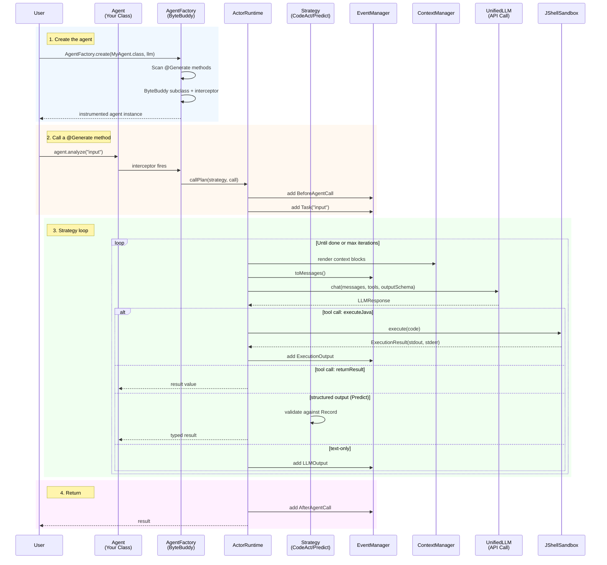

# NOOA Java — Object-Oriented Agents

An agent is a single Java class. Methods are capabilities, fields are state,
annotations are metadata. The SDK handles LLM generation, code execution,
and structured output enforcement.

## Quick Start

```java
class GreetingAgent extends Agent {
    public GreetingAgent(UnifiedLLM llm) { super(llm); }

    /** Create a warm, personalized greeting. */
    @Generate
    public String greet(String name) {
        throw new UnsupportedOperationException("Generated at runtime");
    }
}

var llm = UnifiedLLM.create(
    UnifiedLLM.openAI(System.getenv("OPENAI_API_KEY"), "gpt-4o").build());
var agent = AgentFactory.create(GreetingAgent.class, llm);
String greeting = agent.greet("Alice");
System.out.println(greeting);
```

**Requirements:** Java 21+ · Maven 3.9+

```xml
<dependency>
  <groupId>ai.nooa</groupId>
  <artifactId>nooa-core</artifactId>
  <version>0.1.0</version>
</dependency>
```

## Architecture



### Component Map

```
┌──────────────────────────────────────────────────────────┐
│                    Your Agent Class                        │
│  ┌──────────┐  ┌──────────┐  ┌────────────────────────┐  │
│  │ @Generate │  │ @Generate│  │ public String helper() │  │
│  │ String    │  │ @Strategy│  │ { return "done"; }     │  │
│  │ analyze() │  │ classify │  │                        │  │
│  └────┬─────┘  └────┬─────┘  └───────────┬────────────┘  │
│       │              │                    │               │
│  ┌────┴──────────────┴────────────────────┴───────────┐  │
│  │              AgentFactory (ByteBuddy)               │  │
│  │  Intercepts @Generate → routes to ActorRuntime     │  │
│  └──────────────────────┬─────────────────────────────┘  │
└─────────────────────────┼────────────────────────────────┘
                          │
┌─────────────────────────┼────────────────────────────────┐
│                 ActorRuntime                              │
│  ┌──────────┐  ┌──────────┐  ┌──────────┐  ┌──────────┐ │
│  │generate()│  │execute() │  │callPlan()│  │ stats()  │ │
│  └────┬─────┘  └────┬─────┘  └────┬─────┘  └──────────┘ │
└───────┼─────────────┼─────────────┼──────────────────────┘
        │             │             │
  ┌─────┴─────┐ ┌─────┴──────┐ ┌──┴────────────┐
  │ UnifiedLLM │ │JShellSandbox│ │Strategy        │
  │ (HTTP)     │ │ (JDK built- │ │ CodeAct        │
  │ OpenAI     │ │  in JShell) │ │ Predict        │
  │ Anthropic  │ │ Timeout     │ │ Reflexion      │
  │ OpenRouter │ │ Permissions │ └───────────────┘
  │ DeepInfra  │ └────────────┘
  │ Groq       │
  │ Ollama     │
  └────────────┘

┌──────────────────────────────────────────────────────────┐
│                 Supporting Services                       │
│  ┌──────────┐  ┌──────────┐  ┌──────────┐  ┌──────────┐ │
│  │ Context  │  │  Event   │  │  Memory  │  │ Tracing  │ │
│  │ Manager  │  │ Manager  │  │  (SQLite)│  │ (OTel)   │ │
│  └──────────┘  └──────────┘  └──────────┘  └──────────┘ │
│  ┌──────────┐  ┌──────────┐  ┌──────────┐  ┌──────────┐ │
│  │  Shell   │  │   MCP    │  │   Todo   │  │Snapshot  │ │
│  │  Tools   │  │ Manager  │  │ Manager  │  │Save/Rest │ │
│  └──────────┘  └──────────┘  └──────────┘  └──────────┘ │
└──────────────────────────────────────────────────────────┘
```

## Core Concepts

### 1. An Agent Is a Java Class

Every agent extends `Agent`. Every method has a role:

| Method type | How to write it | What happens |
|---|---|---|
| **Generation** | `@Generate` + Javadoc | Body replaced at runtime by LLM-generated code |
| **Deterministic helper** | Normal method body | Runs as regular Java, visible to the LLM |
| **Orchestrator** | Normal method body, calls other methods | Pure Java workflow — classify → route → act |

```java
@SystemPrompt("You are a legal intake specialist.")
class LegalIntakeAgent extends Agent {

    public LegalIntakeAgent(UnifiedLLM llm) { super(llm); }

    // ---- Deterministic helpers (the LLM can call these) ----
    boolean isEmergency(String message) {
        return message.toLowerCase().contains("urgent")
            || message.toLowerCase().contains("dying");
    }

    // ---- Generation methods (LLM completes these) ----
    @Generate @Strategy(PredictStrategy.class)
    public Classification classify(String message) {
        throw new UnsupportedOperationException();
    }

    @Generate
    public String respond(String message, Classification classification) {
        throw new UnsupportedOperationException();
    }

    // ---- Orchestrator (pure Java — no LLM calls itself) ----
    public String handle(String message) {
        var classification = classify(message);
        if (classification.urgency() == Priority.EMERGENCY) {
            context().put("priority", "EMERGENCY — respond in under 30 seconds");
        }
        return respond(message, classification);
    }
}

enum Priority { LOW, MEDIUM, HIGH, EMERGENCY }
record Classification(String topic, Priority urgency, String summary) {}
```

Key design rule: **one method = one LLM task**. Don't make a method do classification AND implementation. Split into classify → route → act. Orchestrators are pure Java.

### 2. Strategies Control How the LLM Completes a Method

Two strategies cover 95% of use cases:

| Strategy | Use when | Returns |
|---|---|---|
| `CodeActStrategy` (default) | The LLM needs to run code, call helpers, iterate | Any type — result of code execution |
| `PredictStrategy` | Classification, extraction, single-pass tasks | A Java Record (structured output) |

```java
// Default: CodeActStrategy — REPL loop with executeJava + returnResult tools
@Generate
public String calculate(String problem) { ... }

// Explicit: PredictStrategy — single LLM call, validates against Record schema
@Generate @Strategy(PredictStrategy.class)
public SentimentResult classify(String text) { ... }

record SentimentResult(String sentiment, double confidence) {}
```

### 3. Visibility: Everything Visible By Default

Hide explicitly to keep secrets and internals out of the LLM's view:

```java
@Hidden private String apiKey = "sk-...";   // field
@Hidden void rebuildIndex() { ... }          // method
```

The LLM discovers available methods and fields through auto-generated documentation (`AgentDoc`). Public methods and fields are visible. `@Hidden` excludes them.

### 4. Context Blocks and Events

Context blocks are key-value pairs rendered into the system prompt before each LLM call. Events are the conversation history.

```java
// Static block — set once, stays forever
context().put("focus", "security analysis");

// Dynamic block — re-evaluated every LLM turn
context().putDynamic("project_status", "self.formatProjectStatus()");

// Remove a block
context().remove("focus");
```

The LLM can access these from generated code too:

```java
// In generated code:
__context__.put("current_task", "analyze auth module");
var pastErrors = __events__.findByType("ErrorEvent");
```

### 5. Long-Term Memory

Agents accumulate knowledge across sessions in a human-readable SQLite file:

```java
var store = new MemoryStore("agent_memory.db");
store.scheduleReflection(3600); // prune/merge every hour

// Attach to an agent
var memory = new MemorySkill(agent, store);

// Write from generated code or orchestrators:
memory.write("fact", "User prefers dark mode", 0.8, List.of("preference", "ui"));
memory.write("episode", "Fixed auth bug in login flow", 0.9, List.of("auth", "bugfix"));

// Recall relevant memories:
var relevant = memory.recall(List.of("auth", "bugfix"), 5);

// Query by type:
var preferences = memory.query("preference", null, 10);

// Link records:
memory.relate(record1.id(), "contradicts", record2.id());
memory.relate(record1.id(), "supports", record3.id());

// Background reflection runs automatically
// → merges duplicates, distills episodes into insights, prunes stale
```

### 6. Provider Support

OpenAI, Anthropic, OpenRouter, DeepInfra, Groq, local Ollama, and any
OpenAI-compatible endpoint — all with automatic retry on 429/5xx:

```java
// OpenAI
var llm = UnifiedLLM.create(UnifiedLLM.openAI(key, "gpt-4o").build());

// Anthropic
var llm = UnifiedLLM.create(UnifiedLLM.anthropic(key, "claude-sonnet-4-5").build());

// OpenRouter
var llm = UnifiedLLM.create(
    UnifiedLLM.openRouter(key, "anthropic/claude-sonnet-4-5").build());

// DeepInfra (hosted open-source models)
var llm = UnifiedLLM.create(
    UnifiedLLM.deepInfra(key, "meta-llama/Llama-4-Maverick-17B-128E").build());

// Groq (fast inference)
var llm = UnifiedLLM.create(
    UnifiedLLM.groq(key, "llama-4-maverick-17b-128e").build());

// Local Ollama — no API key needed
var llm = UnifiedLLM.create(UnifiedLLM.ollama("llama3.2").build());

// Any OpenAI-compatible endpoint
var llm = UnifiedLLM.create(
    UnifiedLLM.custom("https://my-proxy.example.com/v1", key, "my-model").build());

// Retry configuration
var llm = UnifiedLLM.create(
    UnifiedLLM.openAI(key, "gpt-4o").maxRetries(5).build());
```

### 7. Tracing

Set `NOOA_TRACE_DIR` to enable JSONL tracing automatically. Or programmatic:

```java
Tracing.enable(Tracing.jsonl(Path.of("./traces")));
// All agent calls, LLM calls, and code execution get OTel spans
```

### 8. MCP Integration

Connect to MCP servers for additional tools:

```java
var mcp = new McpManager()
    .connectStdio("filesystem", List.of("npx", "-y",
        "@modelcontextprotocol/server-filesystem", "/workspace"))
    .connectStdio("github", List.of("npx", "-y",
        "@modelcontextprotocol/server-github"));

// Discovered tools are available to the LLM
var tools = mcp.allTools(); // pass to generate() or CodeActStrategy

// Call from generated code or orchestrators:
mcp.callTool("filesystem", "read_file", Map.of("path", "/workspace/src/Main.java"));
```

### 9. Shell Access

Agents can run commands and read/write files:

```java
var shell = new ShellTools(Path.of("/tmp/workspace"));
shell.run("git diff HEAD~1");
String content = shell.read("src/Main.java");
shell.writeFile("output.txt", result);
String preview = shell.view("large_file.log"); // auto-truncated
```

### 10. Task Tracking

```java
var todos = new TodoManager();
var task = todos.add("Implement login", "high");
todos.markInProgress(task.id());
todos.markCompleted(task.id());
System.out.println(todos.showActive());
```

## Complete Walkthrough: Research Agent

```java
@SystemPrompt("You research topics and write structured reports.")
class ResearchAgent extends Agent {

    record Report(String title, String summary, List<String> keyFindings) {}

    public ResearchAgent(UnifiedLLM llm) { super(llm); }

    // The LLM can use this tool from generated code
    String searchWeb(String query) {
        return "Results for: " + query; // real impl would call an API
    }

    // Phase 1: gather information (CodeActStrategy — default)
    @Generate
    public List<String> gatherFacts(String topic) {
        // LLM calls searchWeb(), analyzes results, returns facts
        throw new UnsupportedOperationException();
    }

    // Phase 2: write structured report (PredictStrategy)
    @Generate @Strategy(PredictStrategy.class)
    public Report writeReport(String topic, List<String> facts) {
        // LLM receives facts as context, produces structured Report
        throw new UnsupportedOperationException();
    }

    // Orchestrator — pure Java
    public Report research(String topic) {
        context().put("topic", topic);
        context().putDynamic("progress", "self.getProgress()");

        var facts = gatherFacts(topic);
        return writeReport(topic, facts);
    }

    public String getProgress() {
        return "Gathered facts: analyzing " + eventManager().size() + " events";
    }
}

// Usage:
var agent = AgentFactory.create(ResearchAgent.class, llm);
Report report = agent.research("AI agent frameworks");
System.out.println(report.title() + ": " + report.summary());
```

## Testing

Uses `FakeLLMClient` for fully isolated unit tests — no API key needed:

```java
var llm = new FakeLLMClient();
llm.respondWith("Hello, World!");  // script the response

var agent = new TestAgent(llm);
var result = strategy.execute(agent.runtime(), call);
assertThat(result).isEqualTo("Hello, World!");
```

```bash
mvn test   # 135 tests, all passing
```

## Why Java?

The Python NOOA framework proves that **agent-as-a-single-class** produces better
results across SWE-bench, ARC-AGI-3, and CyberGym. Six design ideas from the paper:

| Idea | Java Implementation |
|---|---|
| Typed input/output | Records as enforced return type contracts |
| Pass by reference | Live objects in JShell, not serialized text |
| Code as action | LLM writes Java, executed in JShell |
| Programmable loops | Plug-and-play `GenerationStrategy` implementations |
| Object state | Instance fields on the Agent |
| Model-callable APIs | `context()`, `events()`, `memory()` from generated code |

## License

Apache 2.0
