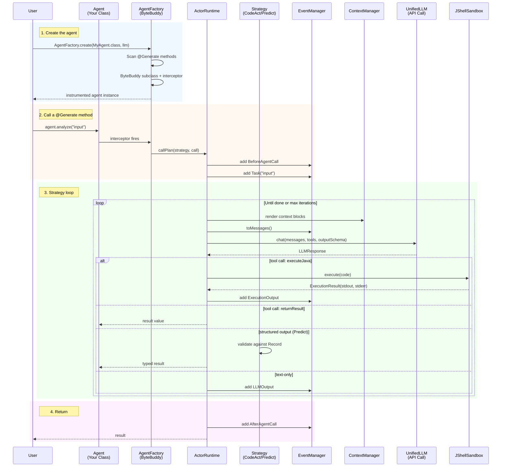

# Architecture

NOOA keeps the primary abstraction a Java object and moves the agent machinery
into the runtime. This page describes the end-to-end execution path and the
components involved. For the conceptual model, see [concepts.md](concepts.md).

## Execution pipeline

Creating an agent instruments its class; calling a `@Generate` method routes the
call through `ActorRuntime`, the configured strategy, the LLM provider, and (for
CodeAct) the JShell sandbox, emitting events along the way.



## Component map

```
┌──────────────────────────────────────────────────────────┐
│                    Your Agent Class                        │
│  ┌──────────┐  ┌──────────┐  ┌────────────────────────┐  │
│  │ @Generate │  │ @Generate│  │ public String helper() │  │
│  │ String    │  │ @Strategy│  │ { return "done"; }     │  │
│  │ analyze() │  │ classify │  │                        │  │
│  └────┬─────┘  └────┬─────┘  └───────────┬────────────┘  │
│       │              │                    │               │
│  ┌────┴──────────────┴────────────────────┴───────────┐  │
│  │              AgentFactory (ByteBuddy)               │  │
│  │  Intercepts @Generate → routes to ActorRuntime     │  │
│  └──────────────────────┬─────────────────────────────┘  │
└─────────────────────────┼────────────────────────────────┘
                          │
┌─────────────────────────┼────────────────────────────────┐
│                 ActorRuntime                              │
│  ┌──────────┐  ┌──────────┐  ┌──────────┐  ┌──────────┐ │
│  │generate()│  │execute() │  │callPlan()│  │ stats()  │ │
│  └────┬─────┘  └────┬─────┘  └────┬─────┘  └──────────┘ │
└───────┼─────────────┼─────────────┼──────────────────────┘
        │             │             │
  ┌─────┴─────┐ ┌─────┴──────┐ ┌──┴────────────┐
  │ UnifiedLLM │ │JShellSandbox│ │Strategy        │
  │ (HTTP)     │ │ (JDK built- │ │ CodeAct        │
  │ OpenAI     │ │  in JShell) │ │ Predict        │
  │ Anthropic  │ │ Timeout     │ │ Reflexion      │
  │ OpenRouter │ │ Permissions │ └───────────────┘
  │ DeepInfra  │ └────────────┘
  │ Groq       │
  │ Ollama     │
  └────────────┘

┌──────────────────────────────────────────────────────────┐
│                 Supporting Services                       │
│  ┌──────────┐  ┌──────────┐  ┌──────────┐  ┌──────────┐ │
│  │ Context  │  │  Event   │  │  Memory  │  │ Tracing  │ │
│  │ Manager  │  │ Manager  │  │  (SQLite)│  │ (OTel)   │ │
│  └──────────┘  └──────────┘  └──────────┘  └──────────┘ │
│  ┌──────────┐  ┌──────────┐  ┌──────────┐  ┌──────────┐ │
│  │  Shell   │  │   MCP    │  │   Todo   │  │Snapshot  │ │
│  │  Tools   │  │ Manager  │  │ Manager  │  │Save/Rest │ │
│  └──────────┘  └──────────┘  └──────────┘  └──────────┘ │
└──────────────────────────────────────────────────────────┘
```

The package-level map and class starting points live in
[package-reference.md](package-reference.md).

## Observations from the pipeline

- **Instrumentation is one-time and cached.** `AgentFactory` builds a ByteBuddy
  subclass per agent class and reuses it, so creating many instances is cheap.
- **Everything is event-sourced.** Context, tracing, prompt capture, snapshots,
  ATIF export, and evaluation all consume the same `Event` stream (see
  [observability.md](observability.md)). This is why the eval layer needs no
  separate instrumentation.
- **The sandbox is a permission boundary, not isolation.** CodeAct cells run in
  an in-process JShell sandbox behind a static permission gate; see
  [security.md](security.md).
